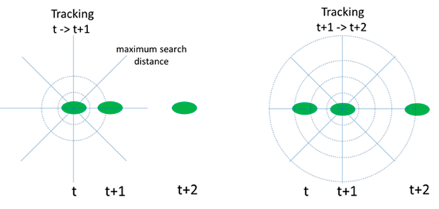

# Cell Tracking
This is an ImageJ/Fiji macro, which can track cells in time-lapse sequence movies. The input to the macro is a thresholded binary time-lapse stack, where cells are properly segmented.

  

legend:

# Download

# Description
Following is a diagram illustrating how cells are tracked from time: t to t+1 and then from t+1 to t+2. Green ovals represent cell nucleus at different times and circles of different radii represent successive search increments.

# How to Cite
Sharma, V.P.; Williams, J.; Leung, E.; Sanders, J.; Eddy, R.; Castracane, J.; Oktay, M.H.; Entenberg, D.; Condeelis, J.S. SUN-MKL1 Crosstalk Regulates Nuclear Deformation and Fast Motility of Breast Carcinoma Cells in Fibrillar ECM Microenvironment. Cells 2021, 10, 1549. https://doi.org/10.3390/cells10061549

# License
See [license](https://github.com/ved-sharma/HyperStackReg/blob/master/LICENSE) file
