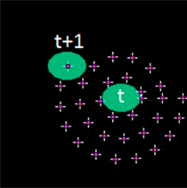
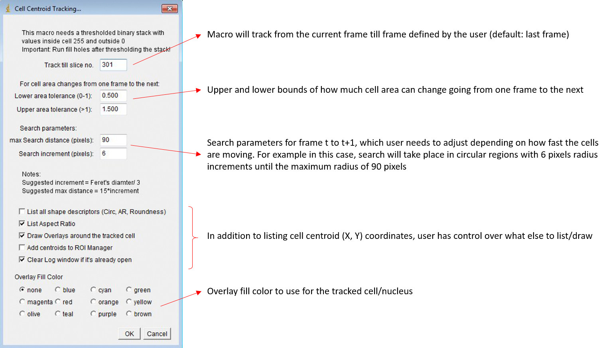

# Cell Centroid Tracking
This is an ImageJ/Fiji macro, which can track cells in time-lapse sequence movies. The input to the macro is a thresholded binary time-lapse stack, where cells are properly segmented (no touching cells or cells with holes!).

  

# Download
<a href="Cell_Centroid_Tracking_macro.ijm" download>Cell_Centroid_Tracking_macro.ijm<a/>
  
# Description
Following is a diagram illustrating how cells are tracked from time: t to t+1 and then from t+1 to t+2. Green ovals represent cell nucleus at different times and circles of different radii represent successive search increments.

Here is how it looks on an image with nucleus shown in green at time points t and t+1. The program starts searching in the neighborhood with increased radii:

Here is the user interface for setting the parameters for cell tracking:

Tracking happens one cell at a time. User needs to trace the cell using either the Wand tool or the freehand selection in the first frame and then run this macro. After tracking is completed, macro prints a list of (X, Y) cell centroid coordinates (+ other user-selected measurements) for the tracked cell in a tab-delimited log file, which can be copied and pasted into a CSV or Excel file for futher cell motility analysis.
  
# How to Cite
Sharma, V.P.; Williams, J.; Leung, E.; Sanders, J.; Eddy, R.; Castracane, J.; Oktay, M.H.; Entenberg, D.; Condeelis, J.S. SUN-MKL1 Crosstalk Regulates Nuclear Deformation and Fast Motility of Breast Carcinoma Cells in Fibrillar ECM Microenvironment. Cells 2021, 10, 1549. https://doi.org/10.3390/cells10061549

# License
See [license](https://github.com/ved-sharma/HyperStackReg/blob/master/LICENSE) file
